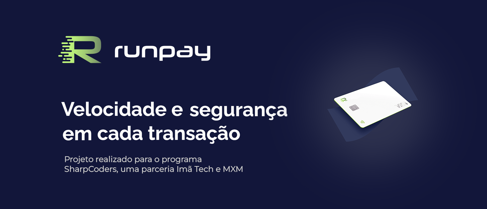
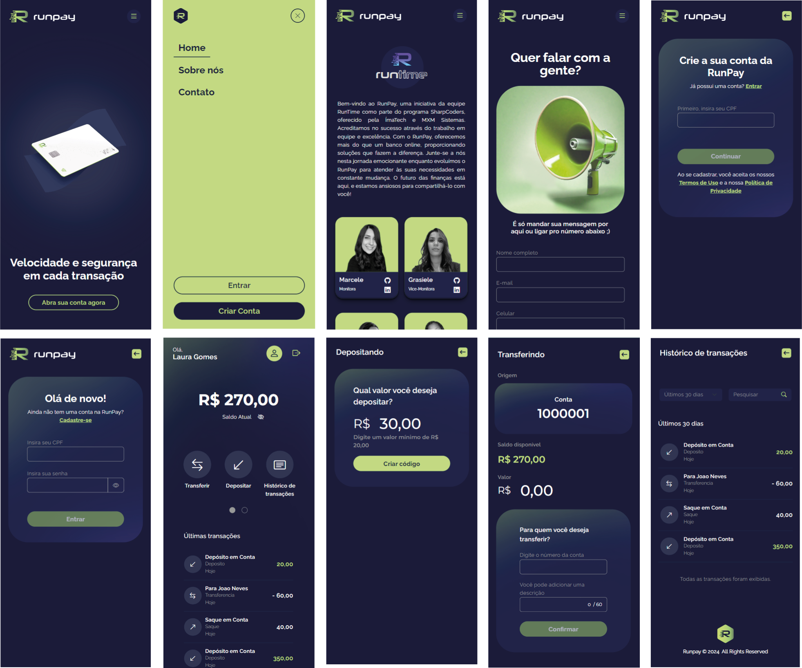
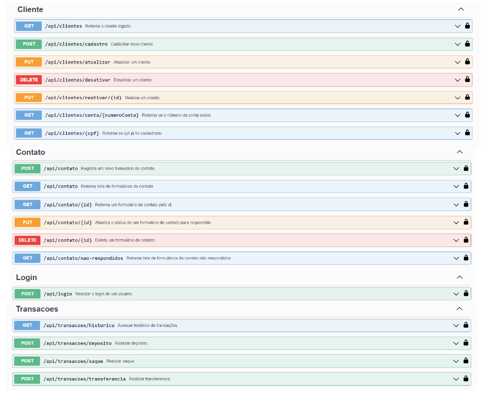

<p align="center">
  

  
  
  <a href="https://github.com/marceleeller/runpay-hackadev/commits/master">
    
  </a>

  <a href="https://rocketseat.com.br">
    
  </a>
</p>

<h1 align="center">
    
</h1>

<h4 align="center">
   💲RunPay💲
</h4>

<p align="center">
 <a href="#-sobre-o-projeto">Sobre</a> •
 <a href="#-funcionalidades">Funcionalidades</a> •
 <a href="#-layout">Layout</a> •
 <a href="#-api">API</a> •
 <a href="#-como-executar-o-projeto">Como executar</a> •
  <a href="#-tecnologias">Tecnologias</a> •
 <a href="#-contribuidores">Contribuidores</a>
</p>

## 💻 Sobre o projeto

💲RunPay - é um projeto de uma fintech, desenvolvido pela equipe RunTime, criado para simular um ambiente empresarial, onde a equipe desenvolveu um projeto seguindo a metodologia SCRUM. Esse projeto faz parte do bootcamp SharpCoders, oferecido pela ÍmaTech e MXM Sistemas.

---

## ⚙️ Funcionalidades

- [x] Cadastro:
  - O usuário consegue criar sua conta, informando os dados necessários para a criação de uma conta em um banco digital. Nela seu CPF é inicialmente verificado para depois seguir com o cadastro. Concluído o cadastro, a senha é armazenada através da criptografia Salt Hash.
- [x] Login:
  - Após cadastrado, o login é realizado através do CPF e senha. Podem ser realizadas 3 tentativas de login, caso ultrapasse, há um bloqueio de 30 minutos na conta. A partir do login é gerado um token JWT para autenticação.
- [x] HomePage:
  - A homepage do nosso banco dá as boas-vindas aos usuários, fornecendo uma prévia rápida do aplicativo. Aqui, eles podem criar uma conta, acessar ajuda através de um formulário de contato ou verificar informações sobre nós.
- [x] Sobre nós:
  - Nesta página está a descrição sobre o time RunTime e a listagem dos membros da equipe.
- [x] Contato:
  - Os visitantes podem abrir um atendimento através do formulário de contato.
- [x] Tela Inicial:
  - Esta é a tela principal da aplicação, acessada após o login. Aqui será exibido os gastos e ganhos do mês, o saldo e os usuários podem acessar todas as funcionalidades do nosso site, incluindo transferências, depósito e histórico de transações.
- [x] Histórico de Transações:
  - Na tela de histórico, os usuários podem monitorar suas transações ao longo do tempo, fornecendo um registro detalhado de despesas e receitas. Informações como método de pagamento, remetente, destinatário e valores são claramente apresentadas. Além disso, os usuários têm a flexibilidade de filtrar transações por períodos específicos e realizar pesquisas por termos específicos, facilitando a localização de informações relevantes.
- [x] Depósito:
  - Na tela de depósito, os usuários podem realizar um depósito mínimo de R$ 20,00.
- [x] Transferência:
  - Para transferência, o usuário deverá inserir o número da conta destino e uma mensagem opcional. A partir da inserção desses dados, será validado o número de conta e abrirá um modal de confirmação de senha.

---

## 🎨 Layout

### Web


### Mobile



---

## 🌐 API



---

## 🚀 Como executar o projeto

Este projeto é divido em duas partes:

1. Backend (pasta BackEnd)
2. Frontend (pasta FrontEnd)

💡O Frontend necessita que o Backend esteja sendo executado para funcionar.

### Pré-requisitos

Antes de começar, você vai precisar ter instalado em sua máquina as seguintes ferramentas:
[Angular](https://angular.io/), [NodeJs](https://nodejs.org/en), [NPM](https://www.npmjs.com/)  e [.NET](https://dotnet.microsoft.com/en-us/)
Além disto é bom ter um editor para trabalhar com o código como [VSCode](https://code.visualstudio.com/)

#### 🎲 Rodando o Backend (servidor)

```bash

# Clone este repositório
$ git clone https://github.com/marceleeller/runpay-hackadev.git

# Acesse a pasta do projeto backend no terminal/cmd
$ cd BackEnd/Runpay.API/Runpay.API/

# Restaure as dependências e compile o projeto:
$ dotnet restore
$ dotnet build

# Inicie o servidor com o comando:
$ dotnet watch run

# O servidor iniciará  na porta:7028 - acesse http://localhost:7028 
# Swagger será iniciado automaticamente

```

#### 🧭 Rodando a aplicação web (Frontend)

```bash

# Clone este repositório
$ git clone https://github.com/marceleeller/runpay-hackadev.git

# Vá para a pasta da aplicação Front End
$ cd frontend

# Instale as dependências
$ npm install

# Inicie o servidor em angular
$ ng serve

# A aplicação será aberta na porta:4200 - acesse http://localhost:4200

```

---

## 🛠 Tecnologias

As seguintes ferramentas foram usadas na construção do projeto:

#### **FrontEnd**  ([Angular](https://angular.io/)  +  [Bootstrap](https://getbootstrap.com/))

#### **BackEnd**  ([.NET](https://dotnet.microsoft.com/en-us/))

## 👨‍💻 Contribuidores

💜 Um muito obrigado 👏 para essa galera que fez esse projeto acontecer!

<table>
  <tr>
    <td align="center">
      <a href="https://github.com/marceleeller">
        <br>
        <sub>
          <b>Marcele Eller</b>
          <p>Monitora</p>
        </sub>
      </a>
    </td>
    <td align="center">
      <a href="https://github.com/grasieletinoco">
        <br>
        <sub>
          <b>Grasiele Tinoco</b>
          <p>Vice-monitora</p>
        </sub>
      </a>
    </td>
    <td align="center">
      <a href="https://github.com/isadeop">
        <br>
        <sub>
          <b>Isadora de Oliveira</b>
          <p>Desenvolvedora</p>
        </sub>
      </a>
    </td>
    <td align="center">
      <a href="https://github.com/JaquelineAPSantos">
        <br>
        <sub>
          <b>Jaqueline Santos</b>
          <p>Desenvolvedora</p>
        </sub>
      </a>
    </td>
  </tr>
  <tr>
    <td align="center">
      <a href="https://github.com/PAKell">
        <br>
        <sub>
          <b>Kelly Pedroso</b>
          <p>Desenvolvedora</p>
        </sub>
      </a>
    </td>
    <td align="center">
      <a href="https://github.com/ErickFPrado">
        <br>
        <sub>
          <b>Erick Prado</b>
          <p>Desenvolvedor</p>
        </sub>
      </a>
    </td>
    <td align="center">
      <a href="https://github.com/giperuzzo">
        <br>
        <sub>
          <b>Gislene Peruzzo</b>
          <p>Desenvolvedora</p>
        </sub>
      </a>
    </td>
    <td align="center">
      <a href="https://github.com/Antoniobarrosdecastro">
        <br>
        <sub>
          <b>Antonio Barros</b>
          <p>Desenvolvedora</p>
        </sub>
      </a>
    </td>
  </tr>
</table>
